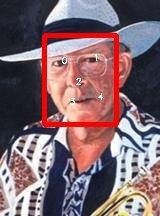
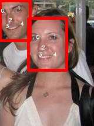

# LightWeightFaceDetector

## update20210510
Upload a new face detection dataset with face box and 5 landmarks. this dataset makes up of big face and helps to improve detection acc with close face.You can add this dataset to widerface.


[MobileFaceDet](https://pan.baidu.com/s/1x8zATo7TDx300JLPxyvI8g) passwords: eu8w
开源一个近场景人脸检测和关键点数据集，数据集包含了27k+张人脸标注，全部为近距离人脸，类似于手机前置拍摄。有助于改善移动端人脸检测和关键点回归精度，将这个数据集和widerface train数据集合并，可以训练了一个大小仅仅120k的人脸检测模型.
数据集标注如下：





Ultra Light Weight Face Detection with Landmark, model size  is around 1M+ for Mobile or Edge devices. I samplified  RetinaFace structure for fast inference.

I test four light-weight network as backbone including mobilenet v1, v2, v3 and efficientnet-b0.

适用于移动端或者边缘计算的轻量人脸检测和关键点检测模型，模型仅仅1M多。主要基于RetinaFace结构简化，删除了前面几个大特征图上的Head，因此小目标的人脸检测可能会有影响，在一般应用场景下影响不大。

这里速度最快的是mobilenet_v2_0.1,效果如图：


## WiderFace Val Performance

| Models            | Easy    | Medium  | Hard    |
| ----------------- | ------- | ------- | ------- |
| mobilenetv1_0.25  | 0.91718 | 0.79766 | 0.3592  |
| mobilenetv2_0.1   | 0.85330 | 0.68946 | 0.2993  |
| mobilenetv3_small | 0.93419 | 0.83259 | 0.3850  |
| efficientnet-b0   | 0.93167 | 0.81466 | 0.37020 |

## Data

1. Download the [WIDERFACE](http://shuoyang1213.me/WIDERFACE/WiderFace_Results.html) dataset.
2. Here we use the organized dataset we used as in the above directory structure.

Link: from [google cloud](https://drive.google.com/open?id=11UGV3nbVv1x9IC--_tK3Uxf7hA6rlbsS) or [baidu cloud](https://pan.baidu.com/s/1jIp9t30oYivrAvrgUgIoLQ) Password: ruck

## Training

We provide four light weight backbone(mobilenetv1, mobilenetv2, mobilenetv3, efficientnetb0) network to train model.

1.make dir ./weights/ and download imagenet pretrained weights from [link](链接: https://pan.baidu.com/s/1zhyL9ULuIi1KdtXzhSQ4yQ 提取码: urei) and put them in ./weights/

```Shell
  ./weights/
      mobilenet0.25_Final.pth
      mobilenetV1X0.25_pretrain.tar
      efficientnetb0_face.pth
      mobilenetv3.pth
      mobilenetv2_0.1_face.pth
      ...
```

1. Before training, you can check network configuration (e.g. batch_size, min_sizes and steps etc..) in ``data/config.py and train.py``.

2. Train the model using WIDER FACE:

  ```Shell
  CUDA_VISIBLE_DEVICES=0,1,2,3 python train.py --network mobilenetv1
  CUDA_VISIBLE_DEVICES=0 python train.py --network mobilenetv1
  ```


## Evaluation

### Evaluation widerface val

1. Generate txt file

```Shell
python test_widerface.py --trained_model weight_file --network mobilenetv1(or mobilenetv2, mobilenetv3, efficientnetb0)
```

2. Evaluate txt results. 

```Shell
cd ./widerface_evaluate
python setup.py build_ext --inplace
python evaluation.py
```
## Android and IOS
Android is deployed with libtorch：https://github.com/midasklr/facedetection_android.pytorch
IOS use ncnn
## References

[Pytorch_Retinaface](https://github.com/biubug6/Pytorch_Retinaface)

